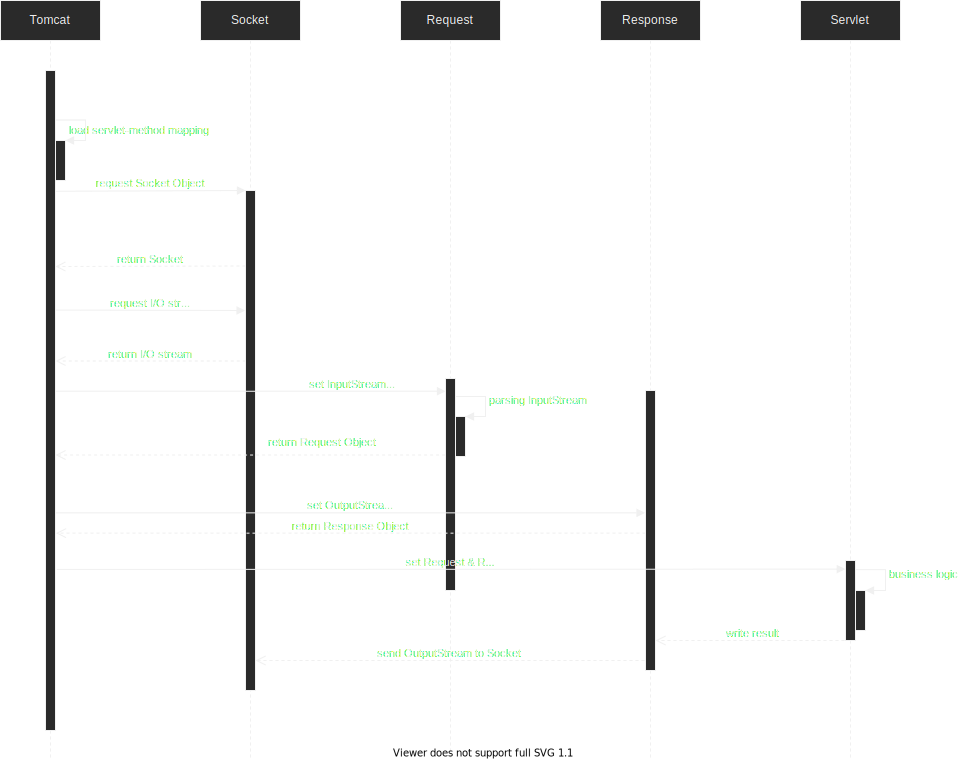
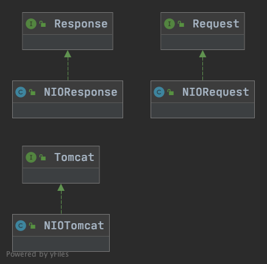
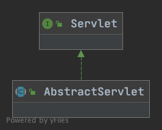

# Tomcat-Mini Demo
## 概述
分别使用BIO, NIO, AIO手动实现Tomcat的核心功能 —— servlet 容器.

## 项目结构
```text
src
├── main
│   ├── java
│   │   ├── App.java
│   │   └── com
│   │       └── turing
│   │           ├── servletImpl (servlet具体逻辑实现) 
│   │           │   └── HelloServlet.java
│   │           └── tomcat
│   │               ├── TomcatFactory.java 
│   │               ├── httpAIOImpl (通过AIO实现的Tomcat)
│   │               ├── httpBIOImpl (通过BIO实现的Tomcat)
│   │               │   ├── BIORequest.java
│   │               │   ├── BIOResponse.java
│   │               │   └── BIOTomcat.java
│   │               ├── httpInterface (Tomcat 接口存放包)
│   │               │   ├── AbstractServlet.java (Servlet的抽象类， 实现了get/post方法的路由分发， 
│   │               │   │                         但是没有实现具体的get/post逻辑)
│   │               │   ├── Request.java (Request 接口)
│   │               │   ├── Response.java (Response 接口)
│   │               │   ├── Servlet.java  (Servlet 接口)
│   │               │   └── Tomcat.java  (tomcat 容器接口)
│   │               ├── httpNIOImpl (通过NIO的Netty实现的Tomcat)
│   │               │   ├── NIORequest.java
│   │               │   ├── NIOResponse.java
│   │               │   └── NIOTomcat.java
│   │               └── utils
│   │                   ├── EventLoopGroupAutoCloseable.java (将EventLoopGroup用AutoCloseable接口封装)
│   │                   ├── NioEventLoopGroupAutoCloseable.java
│   │                   ├── PropertyMappingFactoryImpl.java
│   │                   ├── PropertyMappingFactoryInf.java
│   │                   └── ServletMappingPool.java (使用Enum实现的单例)
│   └── resources
│       ├── log4j2.properties
│       └── web.properties
└── test
    ├── java
    └── resources
```


## UML
### 时序图


### 类图 
> 以NIO实现的为例



